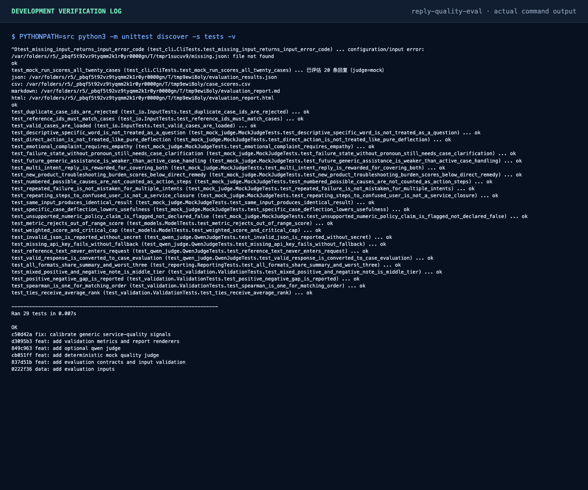
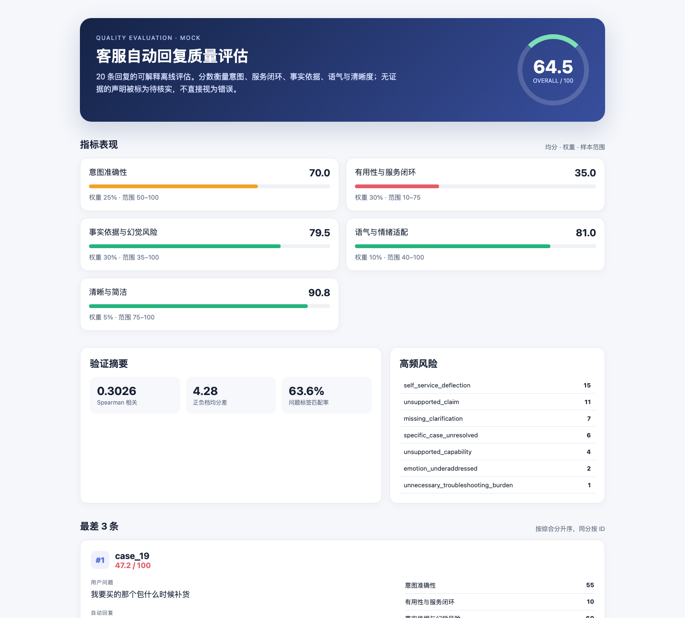

# 0109 · 客服自动回复质量评估流水线

一套可复现、可解释的客服回复评估工具。默认使用无网络依赖的确定性 mock judge，也支持通过 OpenAI-compatible HTTP 接口调用 Qwen。

> 核心结论：20 条样本的加权均分为 **64.49 / 100**，其中“有用性与服务闭环”仅 **35.00** 分。当前更适合继续小流量、有人工兜底的使用，不建议直接扩大全量覆盖。

## 快速运行

需要 Python 3.10 或更高版本，默认模式无第三方依赖。

```bash
PYTHONPATH=src python3 -m reply_eval.cli \
  --input task3_auto_replies.json \
  --human-ref task3_human_ref.json \
  --output-dir outputs \
  --judge mock
```

运行测试：

```bash
PYTHONPATH=src python3 -m unittest discover -s tests -v
```

生成物：

- [HTML 可视化报告](outputs/evaluation_report.html)
- [Markdown 报告](outputs/evaluation_report.md)
- [完整 JSON](outputs/evaluation_results.json)
- [Case 分数 CSV](outputs/case_scores.csv)

## Qwen 模式

Qwen 密钥不保存在仓库中。从 `.env.example` 可以看到所需变量，运行前由用户自行设置：

```bash
export QWEN_API_KEY="your-api-key"
export QWEN_BASE_URL="https://dashscope.aliyuncs.com/compatible-mode/v1"
export QWEN_MODEL="qwen-plus"

PYTHONPATH=src python3 -m reply_eval.cli \
  --input task3_auto_replies.json \
  --human-ref task3_human_ref.json \
  --output-dir outputs-qwen \
  --judge qwen
```

`QWEN_BASE_URL` 和 `QWEN_MODEL` 均可替换。未设置 `QWEN_API_KEY` 时，Qwen 模式会明确失败，不会悄然回退到 mock。请求使用 `temperature=0` 和版本化量表，返回后再经本地结构与分数边界校验。

## 指标定义

每项指标在 Qwen 量表中按 0/25/50/75/100 评分；mock 使用同等级的可见信号组合。

| 指标 | 权重 | 量化方式 | 选择理由 |
|---|---:|---|---|
| 意图准确性 | 25% | 核心诉求、多意图覆盖、必要追问、具体个案处理 | “准确”首先是理解用户真正要解决什么，不是与参考答案字面相似 |
| 有用性与服务闭环 | 30% | 可执行下一步、必要信息索取、主动承接，以及自助转移扣分 | 人工标注最常见的问题是“说得对，但没帮上忙” |
| 事实依据与幻觉风险 | 30% | 检查政策、时效、金额、商品参数与操作能力是否有当前证据 | 将“不瞎编”与“理解问题”分开，否则会混淆两种不同风险 |
| 语气与情绪适配 | 10% | 礼貌、共情、投诉/焦虑/安全场景的情绪强度匹配 | 相同话术在一般咨询和愤怒投诉中的质量不同 |
| 清晰与简洁 | 5% | 长度、步骤结构、重复和无关内部话术 | 防止冗长“完整感”掩盖低效回复 |

综合分：

```text
overall = intent_accuracy * 0.25
        + usefulness       * 0.30
        + groundedness     * 0.30
        + tone             * 0.10
        + clarity          * 0.05
```

高风险虚构承诺、错误安全建议或声称已完成无证据操作会触发 `critical_fail`，综合分最高为 59。一般的外部政策或参数声明只标记 `unsupported_claim`：它表示“当前无证据、待核实”，不等于“已证明错误”。

## 评估方法

```text
JSON 输入校验
  → Mock Judge 或 Qwen Judge
  → 五维分数、证据、风险标签与改进建议
  → 严重风险门槛
  → 整体统计和最差三条
  → 人工参考独立验证
  → JSON / CSV / Markdown / HTML
```

Mock judge 的规则不使用 case ID，重点检测：

- 具体个案是否缺少必要追问；
- 是否只让用户查页面、继续等待或找其他客服；
- 原因枚举是否被冒充为可执行步骤；
- 用户已说“流程看不懂”时，是否只重复流程；
- 新购商品故障场景中，是否把过量排查负担转给用户；
- 多意图是否全部覆盖；
- 投诉、异常登录、敏感肌等场景是否有必要的情绪承接；
- 是否包含无当前证据的时效、政策、材质、质保或服务能力声明。

## 本次结果

### 总体与分布

| 项目 | 结果 |
|---|---:|
| 样本数 | 20 |
| 加权平均分 | **64.49** |
| 优秀（≥85） | 1 |
| 良好（70–84） | 3 |
| 待改进（60–69） | 9 |
| 较差（<60） | 7 |
| `critical_fail` | 0 |

| 指标 | 均分 | <60 | 60–74 | ≥75 |
|---|---:|---:|---:|---:|
| 意图准确性 | 70.00 | 7 | 1 | 12 |
| 有用性与服务闭环 | **35.00** | 16 | 3 | 1 |
| 事实依据与幻觉风险 | 79.50 | 3 | 1 | 16 |
| 语气与情绪适配 | 81.00 | 2 | 0 | 18 |
| 清晰与简洁 | 90.75 | 0 | 0 | 20 |

最明显的结构性问题不是礼貌或可读性，而是缺少服务闭环：20 条中有 15 条触发 `self_service_deflection`，11 条含当前无法验证的外部声明。

### 最差 3 条

1. **case_19 — 47.25**
   
   用户问的是某个具体包的补货时间，回复没有追问商品，而是让用户自己关注或另找客服；“系统会自动提醒”也是未提供证据的能力声明。

2. **case_08 — 51.75**
   
   首句直接给出 TPU 材质，但当前输入没有商品知识来源，因此只能标记为待核实；后续又让用户自己查详情页或找客服。这也暴露了人工标注的内部矛盾：标注说自动回复没有给明确答案，但文本首句实际给出了与参考相同的材质。

3. **case_12 — 51.75**
   
   回复枚举了三个可能原因，但没有追问订单号或主动查询当前物流；同时要求用户继续等待、联系快递或再找客服，服务责任没有闭环。

### 人工参考验证

`human_ref.json` 没有数值标注，因此验证器将标注语句透明地转成正向/中间/负向三档，只用于验证，不参与评分。

- Spearman 排序相关：**0.3026**
- 正向档比负向档平均高：**4.28 分**
- 人工问题标签匹配率：**63.64%**

这只是小样本上的中等偏弱方向一致，不足以证明评估器已经达到生产可信度。报告保留了所有不一致 case，没有用人工答案反向调整单条分数。

## 局限性

1. **缺少事实知识库**
   
   现有数据不包含商品、订单、平台政策和客服工具权限。因此只能识别无证据声明，不能判定“7 天质保”或“1–3 个工作日”究竟是真是假。

2. **服务权限不明**
   
   人工参考大量假设客服可以直接查单、退款、冻结账号、设置提醒或发放补偿，但任务没有提供能力清单。如果系统实际不具备这些权限，“主动承接”反而可能变成虚假承诺。

3. **确定性规则的语义上限**
   
   Mock judge 可解释且可复现，但对委婉表达、反讽、隐含意图和长距离上下文的识别不稳定。例如规则无法完美区分“给出通用信息已经足够”与“必须查具体订单”。

4. **Qwen Judge 仍不是真值**
   
   LLM 受模型版本、提示词、响应格式和采样波动影响。即使设置温度为 0，也应锁定模型版本、定期人工抽检、监测分数漂移。

5. **样本和标注不足**
   
   只有 20 条、单一组叙述性人工参考，不能估计标注者一致性或统计显著性。个别标注本身也存在前提未证实和文本分析不一致。

6. **离线语言质量不等于线上业务结果**
   
   生产决策还应结合问题解决率、重复咨询率、转人工率、用户满意度、安全事故率和不同业务场景的置信区间。

## 生产化改进建议

- 接入版本化的商品、政策、订单和工具能力上下文，让事实依据指标真正可验证。
- 邀请至少 2–3 位标注者使用数值量表独立复标，计算标注者一致性。
- 分场景设定阈值：账号安全、飞行安全、退款时效等高风险场景使用更严格的事实门槛。
- 将 mock 作为稳定回归层，Qwen 作为语义增强层，对两者分歧的 case 优先人工抽检。
- 将线上业务结果与离线分数联合分析，持续校准权重和风险阈值。

## 项目结构

```text
src/reply_eval/
  cli.py            # 命令行编排与退出码
  io.py             # JSON schema 和 ID 校验
  models.py         # 分数契约与加权规则
  mock_judge.py     # 确定性通用规则
  qwen_judge.py     # Qwen OpenAI-compatible 后端
  validation.py     # 人工参考独立验证
  reporting.py      # JSON / CSV / Markdown / HTML
tests/              # 29 项单元与端到端测试
outputs/            # 本次完整评估结果
screenshots/        # 开发和运行结果截图
```

## 截图

### 开发过程



### 运行结果



## AI 工具使用说明

- 使用 Codex 协助业务需求拆解、方案设计、TDD 实现、调试、文档与报告页生成。
- 评分规则、分数、报告与最差三条均通过本地代码实际运行生成，并经自动化测试与跨格式一致性检查。
- 本仓库未保存 Qwen API Key；当前提交的正式报告使用 mock 模式生成，未消耗用户的 Qwen 额度。
- 开发中曾检测到初版规则与人工参考呈负相关，因此通过新增回归测试修正了“描述性具体”误判、原因枚举误当操作步骤、重复流程过度奖励等问题；最终保留实际只有中等偏弱一致的验证结果。
